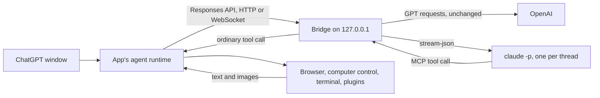

# Claude for ChatGPT Desktop

Use Claude Opus, Sonnet or Haiku in the ChatGPT desktop app on macOS, right in the model picker next to GPT. Claude works with the app's own tools, the same ones GPT uses: the in-app browser, computer control, the terminal, file edits, plugins and connectors, with the app's approvals and tool cards. It runs on your Mac through the Claude Code CLI you already use, and GPT chats keep working exactly as before.

Unofficial and not affiliated with Anthropic or OpenAI. It runs your own Claude Code login, so usage counts against your Claude plan's limits like any other Claude Code session. See Anthropic's [legal and compliance notes for Claude Code](https://code.claude.com/docs/en/legal-and-compliance).

## Install

You need macOS, the [ChatGPT desktop app](https://chatgpt.com/download), Node.js 24 or later, and [Claude Code](https://code.claude.com/docs/en/setup), signed in (run `claude` once and log in).

```sh
git clone https://github.com/wuchris-ch/claude-for-chatgpt-desktop.git
cd claude-for-chatgpt-desktop
npm ci
python3 scripts/setup.py
python3 scripts/install.py
python3 scripts/picker.py install
```

`install.py` installs a small background service. `picker.py install` backs up your ChatGPT settings and adds one setting to them. Quit and reopen ChatGPT, then choose **Claude Opus**, **Claude Sonnet** or **Claude Haiku** in the model picker of any chat. To undo it, run `python3 scripts/picker.py uninstall` and reopen ChatGPT.

### Or a separate window

To leave your usual ChatGPT window untouched, skip `picker.py` and run `python3 scripts/launch.py` (or double-click **Open ChatGPT with Claude.command**). It opens a second ChatGPT window with its own profile that uses only Claude. Sign into ChatGPT once in that window.

## How it works



The app's agent runtime talks to OpenAI over the Responses API. In picker mode one setting, `openai_base_url`, points the app's own OpenAI connection at the bridge. The bridge passes every GPT request and response through unchanged, with the app's own login, WebSocket transport and remote compaction, and adds the Claude models to the model list the app downloads. When a request names a Claude model, the bridge answers it instead: for each conversation it runs Claude Code in headless mode and offers it the app's tools over MCP. When Claude calls a tool, the bridge hands it to the app as an ordinary tool call; the app applies its approval rules, runs its own tool and returns the result, which the bridge passes to the waiting Claude process. The app bundle is not modified, and the bridge has no tools of its own.

The separate window works the same way through its own model provider, without the OpenAI relay.

## Features

- Claude Opus, Sonnet and Haiku in the normal model picker, next to GPT. GPT requests reach OpenAI unchanged.
- Claude drives the app's own tools, including the in-app browser and computer control, with the app's approvals and tool cards.
- One warm Claude process per thread stays alive through a tool cycle and is resumed natively between turns, so the prompt cache carries the conversation. In daily use 97 to 98% of input tokens were read from the cache.
- Messages you send while Claude is working reach the running turn, and Claude answers them in visible text before its next step.
- Stop, then continue: the stopped session resumes with only what changed since the stop.
- Compaction forks the live session so the summary reuses the cache, and the summary reaches the next context window.
- Long browser and computer-control runs keep screenshot history bounded, and a stopped `clock.sleep` cannot hold a session forever.
- Images, edits and regeneration, helper agents, review mode and generated titles work as they do with GPT.
- Switch models within a thread: Claude sees what GPT said and did since its last turn, and GPT can read Claude's compaction summaries.
- In the separate window, the app's built-in web search is available as an opt-in.
- 131 automated tests, live checks against real Claude Code, real OpenAI and the app's own runtime, and the measurements behind each design choice in [VERIFICATION.md](VERIFICATION.md).

## Compared with similar projects

Checked October 4, 2026. Stars are GitHub stars on that date.

| Project | How Claude runs | Claude uses the app's browser and computer control | Notes |
|---|---|---|---|
| This project | Bridge on the app's model API; one warm `claude -p` per thread; the app's tools over MCP | Yes | Claude next to GPT in the normal picker with GPT traffic passed through unchanged, or a separate window |
| [gkorepanov/ccodex](https://github.com/gkorepanov/ccodex) (26 stars) | Claude Agent SDK in front of `codex app-server` | No evidence found; Claude uses Claude Code's own tools | Claude next to GPT in the picker, model switching mid-chat, the phone app, a curl installer, Stop, steering, compaction, side chats, plan mode |
| [EthanSK/claude-in-codex](https://github.com/EthanSK/claude-in-codex) (0 stars) | `claude -p` per message with `--resume`; the app's tools over MCP | Untested: its README reports testing through Codex CLI | |
| [wbopan/claude-in-codex](https://github.com/wbopan/claude-in-codex) (0 stars) | Menu bar app that hooks the app's internals through the Node inspector | Not documented | Notarized DMG; app version 26.924 disabled the hook |
| [Reidond/codex-claude-models-plugin](https://github.com/Reidond/codex-claude-models-plugin) (0 stars) | Claude Agent SDK as a model provider | Not documented | No images or compaction for Claude |
| [lidge-jun/opencodex](https://github.com/lidge-jun/opencodex) (16.9k stars), [router-for-me/CLIProxyAPI](https://github.com/router-for-me/CLIProxyAPI) (54k stars) | General model proxies | Only through raw OAuth tokens or an API key | With raw Claude OAuth tokens: Anthropic blocked third-party use on January 9, 2026 and has billed it as extra usage since April 4, 2026. Their `claude` CLI mode is stateless and has no tools |

## Limits

- macOS only. Tested with ChatGPT 26.930.31730 (embedded Codex runtime 0.160.0), Claude Code 2.1.287 and Node.js 24.21. A later app or Claude Code release can change the protocols involved and need an update here.
- Claude runs in local tasks. Cloud tasks, voice, image generation and other OpenAI-hosted features stay with GPT, and OpenAI-hosted tools in GPT's tool list (such as its built-in web search) are left out of Claude's.
- In picker mode the app reaches OpenAI through the bridge. If the bridge service stops, GPT requests fail until launchd restarts it or you run `picker.py uninstall`. Picker mode needs a ChatGPT sign-in in the app, and it is not meant for ChatGPT workspaces with data-residency routing, which the app applies only when it talks to OpenAI directly.
- A GPT compaction summary is encrypted for GPT. If a thread compacted by GPT switches to Claude, Claude gets the messages kept after the summary and a note that the summary is unavailable.
- Helper agents whose model family differs from their parent's have not been tested.
- Some request options are refused with an error instead of being ignored: forced tool choice, output-token caps, non-JSON text formats, and `parallel_tool_calls=false` with tools.
- Claude Code's safety classifiers can re-run a flagged request on a fallback model, such as Opus 4.8 for Opus 5.5. The bridge then stops the turn with an explanation instead of switching models silently.
- In long browser runs, older screenshots leave Claude's context in batches (the app keeps them), so Claude takes a fresh screenshot when it needs one.
- Haiku has no effort setting, so the picker offers one fixed level for it.

## Configuration

Run `python3 scripts/setup.py --help` for every option. Setup rewrites the Claude profile's settings each time it runs, then `python3 scripts/install.py` applies them to the service.

### Picker mode

`python3 scripts/picker.py install` changes one thing in your ChatGPT profile (`~/.codex`, or `$CODEX_HOME`): it adds a marked `openai_base_url` line to `config.toml`, pointing at the bridge with a private key in the path. It first saves `config.toml` and the app's cached model list to `backups/` in the runtime folder, and it refuses to run if you already set `openai_base_url` yourself or the profile uses another model provider.

`python3 scripts/picker.py uninstall` restores `config.toml` byte for byte when nothing else in it changed, or otherwise removes only the marked line and keeps your later edits, and restores the cached model list. `python3 scripts/picker.py status` shows whether picker mode is on. Reopen ChatGPT after either change.

### Models

[claude-models.json](claude-models.json) lists the picker entries. Each `claude_model` is passed to `claude --model`. The aliases `opus`, `sonnet` and `haiku` follow Claude Code to new releases; on October 4, 2026 they started `claude-opus-5-5`, `claude-sonnet-5-5` and `claude-haiku-4-5-20251001`. To pin a version or add a model, copy the file, edit it, and pass it to setup:

```json
{"slug": "claude-opus-5-5", "claude_model": "claude-opus-5-5", "display_name": "Claude Opus 5.5",
 "efforts": ["low", "medium", "high", "xhigh", "max"], "default_effort": "medium", "context_window": 1000000}
```

```sh
python3 scripts/setup.py --models ~/my-claude-models.json
```

The bridge checks the model Claude Code actually starts. An alias accepts any version of its family; a full model id must match exactly.

### Claude login or API key

By default the bridge runs the unmodified `claude` binary with your normal Claude Code login. It never reads Claude Code's credentials, and it clears inherited `ANTHROPIC_*` and `CLAUDE_*` variables (except `CLAUDE_CONFIG_DIR`) so nothing else changes the account or endpoint.

For heavy use, an Anthropic API key is the better fit: Anthropic's plan limits assume ordinary, individual use of Claude Code. In API key mode Claude Code uses the key instead of your login.

```sh
python3 scripts/setup.py --auth api-key
ANTHROPIC_API_KEY=your-key python3 scripts/install.py
```

The key is stored only in the service definition, `~/Library/LaunchAgents/<label>.plist`, written with mode 0600, and kept when you reinstall. Switch back with `--auth claude-login`.

### Web search (opt-in)

```sh
python3 scripts/setup.py --web-search
python3 scripts/install.py
```

This turns on the app's built-in `web.run` tool for Claude. The app sends each search to the bridge, which forwards it to OpenAI's search endpoint (`https://chatgpt.com/backend-api/codex/alpha/search`) with the Claude window's own ChatGPT sign-in: only the `Authorization` and `ChatGPT-Account-Id` headers, to that one URL, with redirects refused. Searches can include conversation context that the app adds. The bridge reads no credential files and logs only status codes and command types.

### Other options

| Option | Default | Effect |
|---|---|---|
| `--port` | 19480 | Local port of the bridge |
| `--label` | `io.github.wuchris-ch.claude-for-chatgpt-desktop` | LaunchAgent label |
| `--agents-md` | `none` | `codex` links `~/.codex/AGENTS.md` into the Claude profile; `claude` copies `~/.claude/CLAUDE.md` once |
| `--share-skills` | off | Links `~/.codex/skills` into the Claude profile |
| `--app` | `/Applications/ChatGPT.app` | The ChatGPT app to open |

Set `CLAUDE_BRIDGE_RUNTIME` to keep everything in another folder.

## Files

Everything lives in `~/Library/Application Support/Claude for ChatGPT Desktop/`:

| Path | Contents |
|---|---|
| `app/` | Installed copy of the bridge |
| `codex/` | The Claude window's profile: settings, model catalog, plugins and task history |
| `user-data/` | The Claude window's browser and app state |
| `sessions/` | Native session records, system prompts and an encrypted retry cache that expires after 24 hours |
| `logs/` | Request, model, tool-name and lifecycle metadata, and service errors |
| `launch.json`, `token`, `gateway-key` | Settings from setup, and the local keys between the app and the bridge |
| `picker.json`, `backups/` | Picker mode's record of what it changed, and the backups it restores |

Claude Code keeps its own session transcripts as usual.

## Security and privacy

- The bridge listens only on 127.0.0.1, requires a random local key, and refuses requests from browsers.
- Claude Code manages its own login. The app's ChatGPT credentials never reach Claude. In picker mode the bridge passes them, with the rest of each GPT request, only to OpenAI at `chatgpt.com`.
- Logs hold request, model, tool-name and lifecycle metadata. They never contain prompts, tool arguments, tool results, tokens or keys.
- Apart from the one setting picker mode adds, your usual ChatGPT profile in `~/.codex` is only read, to copy its settings and plugins into the separate window's profile.

## Uninstall

```sh
python3 scripts/picker.py uninstall          # take Claude out of the normal picker
python3 scripts/uninstall.py                 # stop and remove the service, keep the Claude profile
python3 scripts/uninstall.py --delete-data   # also delete the Claude profile, history and logs
```

## Design notes

The app's base prompt is written for Codex. The bridge renames its identity lines for the selected Claude model and tells Claude to ignore Claude Code's own working-directory note. Developer messages before the conversation become the system prompt. Notes the app adds later, such as the date, the open page or an interrupted turn, reach Claude where they occur, so a note does not restart a tool cycle or invalidate the prompt cache.

GPT's `apply_patch` output is constrained by a grammar that MCP cannot carry, so the bridge adds a written patch format guide, plus notes on escaping inside JavaScript and on the shared output budget of an `exec` cell. It also passes on host habits found by benchmarking: render PDFs to images in a temporary folder, keep long jobs in the foreground, and avoid `rm -rf`, which the app refuses.

Between user turns Claude Code resumes the saved session. Before resuming, the bridge checks the app's transcript against what the session saw. Edits, undo, regeneration and failed turns rebuild from the app's transcript; a turn stopped by the user or cut off by a bridge restart resumes its native session. While Claude thinks or writes a long tool call, the bridge sends a no-op event every 10 seconds so the app's stall timer does not fire.

Switching Claude models between turns resumes the same native session on the new model; that first request cannot reuse the previous model's cache. If GPT answered in between, its messages and tool activity are passed to the resumed session as history. A compaction keeps the model the session ran on, so its cache still applies.

Over the app's WebSocket, the bridge connects to OpenAI during the handshake so the headers the app reads from it (turn routing, server model) arrive unchanged, then routes each `response.create` by model. For Claude it rebuilds the full input from the increments the app sends after the first request, answers prewarm requests without inference, and treats `response.interrupt` as a Stop. A Claude compaction summary is a sealed item only the bridge can open, so it is turned back into text before a GPT request leaves for OpenAI.

## Development

```sh
npm test               # 131 tests with stand-ins for Claude Code and OpenAI
node e2e/live.mjs      # nine short, low-effort checks with real Claude Code
```

## License

[MIT](LICENSE)
