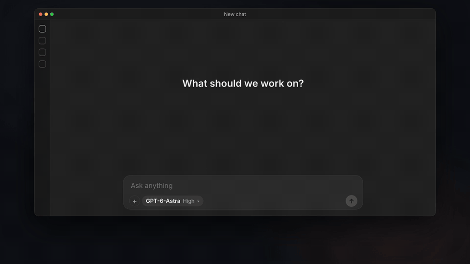
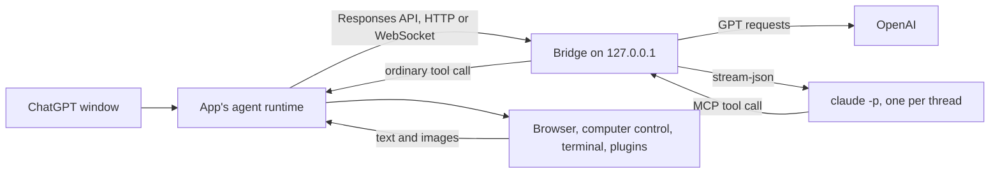

# Claude for ChatGPT Desktop

**Claude in the ChatGPT desktop app's model picker, right next to GPT.** For macOS.



- **Pick Claude Fable, Opus, Sonnet or Haiku** in any chat.
- **Claude uses the app's own tools:** the in-app browser, computer control, terminal, file edits and plugins.
- **Switch between Claude and GPT** in the same chat.
- **Runs on your own Claude Code login.** GPT keeps working exactly as before.

Full 50-second demo: [docs/demo.mp4](docs/demo.mp4)

> Unofficial. Not affiliated with Anthropic or OpenAI. Usage counts against your Claude plan, like any Claude Code session ([Anthropic's notes](https://code.claude.com/docs/en/legal-and-compliance)).

## Install

**You need**

- a Mac
- the [ChatGPT desktop app](https://chatgpt.com/download), opened once and signed in
- [Claude Code](https://code.claude.com/docs/en/setup), signed in (run `claude` once)

**Run**

```sh
curl -fsSL \
  https://raw.githubusercontent.com/wuchris-ch/claude-for-chatgpt-desktop/main/install.sh \
  | bash
```

**Then** pick a Claude model in ChatGPT. The installer offers to reopen ChatGPT for you.

- **Update:** run the same command again.
- **Remove:** add `-s -- --uninstall` after `bash`.
- **Leave your normal ChatGPT untouched:** add `-s -- --window` after `bash` for a separate Claude-only window.

<details>
<summary>What the installer does</summary>

1. Checks for Node.js 24 or later (and offers to install it with Homebrew) and for your Claude Code sign-in.
2. Downloads this repository to `~/Library/Application Support/Claude for ChatGPT Desktop/source`.
3. Installs a small background service that listens only on 127.0.0.1.
4. Backs up your ChatGPT settings and adds one setting, `openai_base_url`.
5. Offers to reopen ChatGPT.

To read it before running it, clone the repository and run `./install.sh`.

</details>

<details>
<summary>Install step by step instead</summary>

```sh
git clone https://github.com/wuchris-ch/claude-for-chatgpt-desktop.git
cd claude-for-chatgpt-desktop
npm ci
python3 scripts/setup.py
python3 scripts/install.py
python3 scripts/picker.py install
```

`install.py` installs the background service. `picker.py install` backs up your ChatGPT settings and adds the one setting. Then reopen ChatGPT. To undo it, run `python3 scripts/picker.py uninstall` and reopen ChatGPT.

</details>

<details>
<summary>Separate window with its own AGENTS.md and skills</summary>

The separate window (`--window`) has its own ChatGPT profile, so it can have its own instructions and skills:

- Put an `AGENTS.md` file and a `skills` folder in `~/Library/Application Support/Claude for ChatGPT Desktop/codex/`. Setup never replaces them.
- Or share your usual ones: `python3 scripts/setup.py --agents-md codex --share-skills` links `~/.codex/AGENTS.md` and `~/.codex/skills`.

To open the window later, double-click **Open ChatGPT with Claude.command** in the downloaded folder, or run `python3 scripts/launch.py`. Sign into ChatGPT once in that window.

</details>

## Features

**Works like GPT does in the app**

- The in-app browser, computer control, terminal, file edits, plugins and connectors, with the app's approvals and tool cards.
- Images, edits, regenerate, helper agents, review mode and chat titles.
- Message Claude while it works. It answers you before its next step.
- Stop, then continue where it left off.
- A question card the app can't show goes back to Claude with the reason, so it asks in a form you can see.

**Switch models freely**

- Claude and GPT in the same chat. Claude sees what GPT did, and GPT can read Claude's summaries.
- Each Claude entry carries the version Claude Code runs, such as Claude Opus 5.5.
- GPT keeps its own login, connection and compaction.

**Fast and cheap on long chats**

- One warm Claude process per chat. In daily use, 97 to 98% of input tokens came from the prompt cache.
- Compaction reuses the cache, even when it fires in the middle of a turn.
- Chats full of screenshots stay under the request size limit, and a stopped `clock.sleep` can't hold a session forever.

**Tested**

- 143 automated tests, plus live checks with real Claude Code, real OpenAI and the app's own runtime. The measurements behind each choice are in [VERIFICATION.md](VERIFICATION.md).

## Limits

- **macOS only.** Tested with ChatGPT 26.1007.21159 (Codex runtime 0.162.0-alpha.17.2), Claude Code 2.1.295 and Node.js 24.21. A later app or Claude Code release can need an update here.
- **Local tasks only.** Cloud tasks, voice, image generation and other OpenAI-hosted features stay with GPT. OpenAI-hosted tools, such as GPT's built-in web search, are left out of Claude's tools.
- **GPT goes through the bridge in picker mode.** If the service stops, GPT requests fail until macOS restarts it or you uninstall. Picker mode needs a ChatGPT sign-in, and isn't meant for ChatGPT workspaces with data-residency routing.
- **GPT's summaries are encrypted for GPT.** If a chat that GPT compacted switches to Claude, Claude gets the messages after the summary and a note that it's unavailable.
- **Helper agents** whose model family differs from their parent's are untested.
- **Some request options are refused** with an error instead of being ignored: forced tool choice, output-token caps, non-JSON text formats, and `parallel_tool_calls=false` with tools.
- **No silent model switches.** If Claude Code's safety classifiers re-run a request on a fallback model, such as Opus 4.8 for Opus 5.5, the bridge stops the turn and says why.
- **Long browser runs** drop older screenshots from Claude's context in batches (the app keeps them), so Claude takes a fresh screenshot when it needs one.

## How it works



- **One setting.** Picker mode sets `openai_base_url`, so the app's OpenAI connection goes to the bridge, which adds the Claude models to the app's model list.
- **GPT requests** go on to OpenAI as the app sends them, with the app's own login, WebSocket connection and compaction. In a chat where Claude also answered, the bridge turns Claude's summaries into text and drops Claude's item ids, which OpenAI can't read.
- **Claude requests** are answered by the bridge: one headless Claude Code process per chat, with the app's tools offered over MCP.
- **Tool calls** go back to the app as ordinary tool calls. The app applies its approvals, runs the tool and returns the result to Claude.
- **Nothing is patched.** The app bundle isn't modified, and the bridge has no tools of its own. The separate window works the same way through its own model provider, without the OpenAI relay.

## Compared with similar projects

Checked October 4, 2026. Stars are GitHub stars on that date.

| Project | How Claude runs | Claude uses the app's browser and computer control | Notes |
|---|---|---|---|
| This project | Bridge on the app's model API; one warm `claude -p` per thread; the app's tools over MCP | Yes | Claude next to GPT in the normal picker with GPT traffic relayed to OpenAI, or a separate window |
| [gkorepanov/ccodex](https://github.com/gkorepanov/ccodex) (26 stars) | Claude Agent SDK in front of `codex app-server` | No evidence found; Claude uses Claude Code's own tools | Claude next to GPT in the picker, model switching mid-chat, the phone app, a curl installer, Stop, steering, compaction, side chats, plan mode |
| [EthanSK/claude-in-codex](https://github.com/EthanSK/claude-in-codex) (0 stars) | `claude -p` per message with `--resume`; the app's tools over MCP | Untested: its README reports testing through Codex CLI | |
| [wbopan/claude-in-codex](https://github.com/wbopan/claude-in-codex) (0 stars) | Menu bar app that hooks the app's internals through the Node inspector | Not documented | Notarized DMG; app version 26.924 disabled the hook |
| [Reidond/codex-claude-models-plugin](https://github.com/Reidond/codex-claude-models-plugin) (0 stars) | Claude Agent SDK as a model provider | Not documented | No images or compaction for Claude |
| [lidge-jun/opencodex](https://github.com/lidge-jun/opencodex) (16.9k stars), [router-for-me/CLIProxyAPI](https://github.com/router-for-me/CLIProxyAPI) (54k stars) | General model proxies | Only through raw OAuth tokens or an API key | With raw Claude OAuth tokens: Anthropic blocked third-party use on January 9, 2026 and has billed it as extra usage since April 4, 2026. Their `claude` CLI mode is stateless and has no tools |

<details>
<summary>Why not just ask Claude or Codex to build one?</summary>

You can, and a basic bridge works in an afternoon. The hard part is the long tail that only shows up in daily use: keeping Claude's prompt cache warm (97 to 98% of input from the cache), compaction that doesn't resend the whole chat, Stop and resume without losing tool results, screenshots that push a long chat past the size limit, and GPT chats that keep working after Claude has answered in them. This one has been used daily for over two weeks, and [VERIFICATION.md](VERIFICATION.md) lists each problem found, its fix and the test that covers it.

</details>

## Configuration

Run the commands below from the downloaded folder (`~/Library/Application Support/Claude for ChatGPT Desktop/source`) or your clone. `python3 scripts/setup.py --help` lists every option. Setup rewrites the Claude profile's settings each time it runs, then `python3 scripts/install.py` applies them to the service.

<details>
<summary>Picker mode</summary>

- `python3 scripts/picker.py install` adds a marked `openai_base_url` line to `config.toml` in your ChatGPT profile (`~/.codex`, or `$CODEX_HOME`), pointing at the bridge with a private key in the path.
  - It first saves `config.toml` and the app's cached model list to `backups/` in the runtime folder.
  - It refuses to run if you already set `openai_base_url` yourself or the profile uses another model provider.
- `python3 scripts/picker.py uninstall` restores `config.toml` byte for byte when nothing else in it changed. Otherwise it removes only the marked line and keeps your later edits. It also restores the cached model list.
- `python3 scripts/picker.py status` shows whether picker mode is on.

Reopen ChatGPT after either change.

</details>

<details>
<summary>Models</summary>

[claude-models.json](claude-models.json) lists the picker entries.

- Each `claude_model` is passed to `claude --model`.
- The aliases `fable`, `opus`, `sonnet` and `haiku` follow Claude Code to new releases. On October 9, 2026 they started `claude-fable-5-1`, `claude-opus-5-5`, `claude-sonnet-5-5` and `claude-haiku-5-5`.
- An alias entry is named after the version Claude Code last started for it, so Claude Fable 5.1 becomes Claude Fable 5.5 after the first chat on the new release.
- The bridge checks the model Claude Code actually starts. An alias accepts any version of its family; a full model id must match exactly.

To pin a version or add a model, copy the file, edit it, and pass it to setup:

```json
{"slug": "claude-opus-5-5", "claude_model": "claude-opus-5-5", "display_name": "Claude Opus 5.5",
 "efforts": ["low", "medium", "high", "xhigh", "max"], "default_effort": "medium", "context_window": 1000000}
```

```sh
python3 scripts/setup.py --models ~/my-claude-models.json
```

</details>

<details>
<summary>Claude login or API key</summary>

- By default the bridge runs the unmodified `claude` binary with your normal Claude Code login.
- It never reads Claude Code's credentials, and it clears inherited `ANTHROPIC_*` and `CLAUDE_*` variables (except `CLAUDE_CONFIG_DIR`) so nothing else changes the account or endpoint.
- For heavy use, an Anthropic API key is the better fit: Anthropic's plan limits assume ordinary, individual use of Claude Code. In API key mode Claude Code uses the key instead of your login.

```sh
python3 scripts/setup.py --auth api-key
ANTHROPIC_API_KEY=your-key python3 scripts/install.py
```

The key is stored only in the service definition, `~/Library/LaunchAgents/<label>.plist`, written with mode 0600, and kept when you reinstall. Switch back with `--auth claude-login`.

</details>

<details>
<summary>Web search (opt-in, separate window)</summary>

```sh
python3 scripts/setup.py --web-search
python3 scripts/install.py
```

- This turns on the app's built-in `web.run` tool for Claude.
- The bridge forwards each search to OpenAI's search endpoint (`https://chatgpt.com/backend-api/codex/alpha/search`) with the Claude window's own ChatGPT sign-in: only the `Authorization` and `ChatGPT-Account-Id` headers, to that one URL, with redirects refused.
- Searches can include conversation context that the app adds. The bridge reads no credential files and logs only status codes and command types.

</details>

<details>
<summary>Other options</summary>

| Option | Default | Effect |
|---|---|---|
| `--port` | 19480 | Local port of the bridge |
| `--label` | `io.github.wuchris-ch.claude-for-chatgpt-desktop` | LaunchAgent label |
| `--agents-md` | `none` | `codex` links `~/.codex/AGENTS.md` into the Claude profile; `claude` copies `~/.claude/CLAUDE.md` once |
| `--share-skills` | off | Links `~/.codex/skills` into the Claude profile |
| `--app` | `/Applications/ChatGPT.app` | The ChatGPT app to open |

Set `CLAUDE_BRIDGE_RUNTIME` to keep everything in another folder.

</details>

## Files

Everything lives in `~/Library/Application Support/Claude for ChatGPT Desktop/`:

| Path | Contents |
|---|---|
| `source/` | The copy of this repository that `install.sh` downloads and updates |
| `app/` | Installed copy of the bridge |
| `codex/` | The Claude window's profile: settings, model catalog, plugins and task history |
| `user-data/` | The Claude window's browser and app state |
| `sessions/` | Native session records, system prompts and an encrypted retry cache that expires after 24 hours |
| `logs/` | Request, model, tool-name and lifecycle metadata, and service errors |
| `launch.json`, `token`, `gateway-key` | Settings from setup, and the local keys between the app and the bridge |
| `picker.json`, `backups/` | Picker mode's record of what it changed, and the backups it restores |

Claude Code keeps its own session transcripts as usual.

## Security and privacy

- **Local only.** The bridge listens only on 127.0.0.1, requires a random local key, and refuses requests from browsers.
- **Separate logins.** Claude Code manages its own login. The app's ChatGPT credentials never reach Claude. In picker mode the bridge passes them, with the rest of each GPT request, only to OpenAI at `chatgpt.com`.
- **No content in logs.** Logs hold request, model, tool-name and lifecycle metadata. They never contain prompts, tool arguments, tool results, tokens or keys.
- **One setting changed.** Apart from the one setting picker mode adds, your usual ChatGPT profile in `~/.codex` is only read, to copy its settings and plugins into the separate window's profile.

## Uninstall

```sh
curl -fsSL \
  https://raw.githubusercontent.com/wuchris-ch/claude-for-chatgpt-desktop/main/install.sh \
  | bash -s -- --uninstall
```

Or from a clone:

```sh
python3 scripts/picker.py uninstall          # take Claude out of the normal picker
python3 scripts/uninstall.py                 # stop and remove the service, keep the Claude profile
python3 scripts/uninstall.py --delete-data   # also delete the Claude profile, history and logs
```

## Design notes

<details>
<summary>Prompts, sessions, model switching and the WebSocket relay</summary>

- **Prompts.** The app's base prompt is written for Codex. The bridge renames its identity lines for the selected Claude model and tells Claude to ignore Claude Code's own working-directory note. Developer messages before the conversation become the system prompt. Notes the app adds later, such as the date, the open page or an interrupted turn, reach Claude where they occur, so a note does not restart a tool cycle or invalidate the prompt cache.
- **Patches and host habits.** GPT's `apply_patch` output is constrained by a grammar that MCP cannot carry, so the bridge adds a written patch format guide, plus notes on escaping inside JavaScript and on the shared output budget of an `exec` cell. It also passes on host habits found by benchmarking: render PDFs to images in a temporary folder, keep long jobs in the foreground, and avoid `rm -rf`, which the app refuses.
- **Sessions.** Between user turns Claude Code resumes the saved session. Before resuming, the bridge checks the app's transcript against what the session saw. Edits, undo, regeneration and failed turns rebuild from the app's transcript; a turn stopped by the user or cut off by a bridge restart resumes its native session. While Claude thinks or writes a long tool call, the bridge sends a no-op event every 10 seconds so the app's stall timer does not fire.
- **Model switching.** Switching Claude models between turns resumes the same native session on the new model; that first request cannot reuse the previous model's cache. If GPT answered in between, its messages and tool activity are passed to the resumed session as history. A compaction keeps the model the session ran on, so its cache still applies.
- **WebSocket relay.** The bridge connects to OpenAI during the app's handshake, so the headers the app reads from it (turn routing, server model) arrive unchanged, then routes each `response.create` by model. For Claude it rebuilds the full input from the increments the app sends after the first request, answers prewarm requests without inference, and treats `response.interrupt` as a Stop. A Claude compaction summary is a sealed item only the bridge can open, so it is turned back into text before a GPT request leaves for OpenAI.

</details>

## Development

```sh
npm test               # 143 tests with stand-ins for Claude Code and OpenAI
node e2e/live.mjs      # eleven short, low-effort checks with real Claude Code
```

## License

[MIT](LICENSE)
